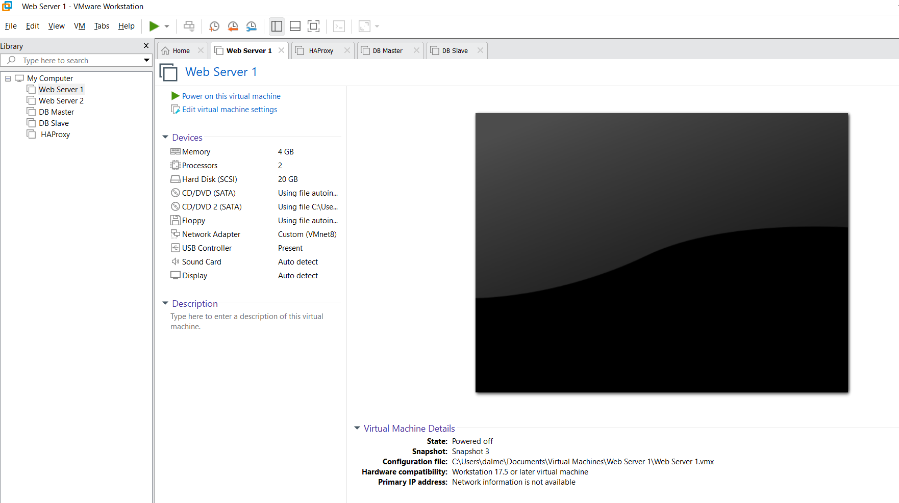

# Coursero — Justification des choix techniques

## 1. Architecture générale

L'infrastructure repose sur 5 machines virtuelles VMware interconnectées en réseau NAT (192.168.126.0/24). Ce choix permet de simuler un environnement de production réaliste avec isolation réseau, tout en restant simple à administrer.

---

## 2. Load balancer — HAProxy

**Choix :** HAProxy en frontal unique, redistribuant le trafic vers deux web servers en HTTPS.

**Justification :**
- HAProxy est la référence open source pour le load balancing L4/L7, avec des performances éprouvées en production.
- Le mode `roundrobin` distribue équitablement les requêtes entre Web Server 1 et Web Server 2.
- La redirection HTTP → HTTPS est gérée directement par HAProxy, centralisant la politique de sécurité.
- Le health check (`ssl-hello-chk`) détecte automatiquement si un backend tombe et l'exclut du pool.

---

## 3. Serveurs web — Apache + PHP

**Choix :** Apache 2.4 avec mod_php sur Ubuntu 24.04.

**Justification :**
- Apache est natif sur Ubuntu et largement documenté, réduisant le temps de configuration.
- PHP est le langage le plus adapté pour un site web dynamique avec accès base de données via PDO/mysqli.
- Les deux web servers sont identiques (même code, même config), garantissant la cohérence en cas de bascule.
- HTTPS activé avec certificat self-signed et configuration TLS renforcée (TLS 1.2+, ciphers forts, HSTS).

---

## 4. Base de données — MySQL Master/Slave

**Choix :** MySQL 8.0 en réplication asynchrone Master → Slave.

**Justification :**
- La réplication Master/Slave assure la haute disponibilité des données : si le Master tombe, le Slave contient une copie à jour.
- Les deux web servers écrivent et lisent sur le Master ; le Slave sert de backup chaud.
- `mysql_native_password` est utilisé pour la compatibilité avec le connecteur Python sans SSL obligatoire.
- Un utilisateur dédié `replicator` est créé avec uniquement le privilège `REPLICATION SLAVE`, respectant le principe du moindre privilège.

**Tables :**
- `users` — informations personnelles des étudiants
- `submissions` — historique de toutes les soumissions avec statut et score
- `best_scores` — meilleur score par étudiant, cours et exercice

---

## 5. Système de correction — Worker Python

**Choix :** Worker Python tournant en service systemd sur Web Server 1.

**Justification :**
- Le worker poll la base de données toutes les 3 secondes (`FOR UPDATE SKIP LOCKED`) pour récupérer les soumissions en attente, implémentant une file d'attente simple et fiable.
- L'exécution est isolée dans un répertoire temporaire (`/opt/coursero/sandbox/`) supprimé après chaque correction.
- Les mesures de sécurité incluent :
  - `ulimit -v 131072` : limite la mémoire virtuelle à 128 Mo
  - `ulimit -f 10` : limite les fichiers créés à 10 blocs
  - `ulimit -n 32` : limite les descripteurs de fichiers
  - `timeout` : arrêt automatique après 5 secondes (anti-boucle infinie)
  - Environnement PATH minimal (`/usr/bin:/bin`)
  - Fichiers soumis copiés en lecture seule (`chmod 444`)
- Le fichier soumis est supprimé après évaluation (`os.remove`).
- Le score est calculé en pourcentage de tests passés et sauvegardé dans `submissions` and `best_scores`.

---

## 6. Sécurité globale

| Mesure | Détail |
|--------|--------|
| HTTPS | TLS 1.2+ sur les deux web servers, certificat SSL, HSTS |
| Isolation exécution | ulimit mémoire/fichiers/descripteurs, timeout, sandbox |
| Moindre privilège | Worker sous `www-data`, replicator MySQL limité |
| Nettoyage | Fichier étudiant supprimé après correction |
| Authentification | Login par email + mot de passe hashé (password_verify PHP) |

---

## 7. Haute disponibilité

| Composant | Mécanisme |
|-----------|-----------|
| Web servers | HAProxy roundrobin + health check |
| Base de données | Réplication MySQL Master → Slave |
| Worker | Service systemd avec `Restart=always` |

---

## 8. Choix technologiques résumés

| Composant | Technologie | Raison |
|-----------|-------------|--------|
| Load balancer | HAProxy | Performance, health check, open source |
| Web server | Apache 2.4 | Natif Ubuntu, stable, mod_php |
| Langage web | PHP 8.3 | Adapté aux formulaires et accès DB |
| Base de données | MySQL 8.0 | Réplication native, fiable |
| Worker | Python 3.12 | Lisibilité, subprocess, mysql.connector |
| OS | Ubuntu 24.04 LTS | Support long terme, packages récents |
| Virtualisation | VMware | Isolation réseau, snapshots |
